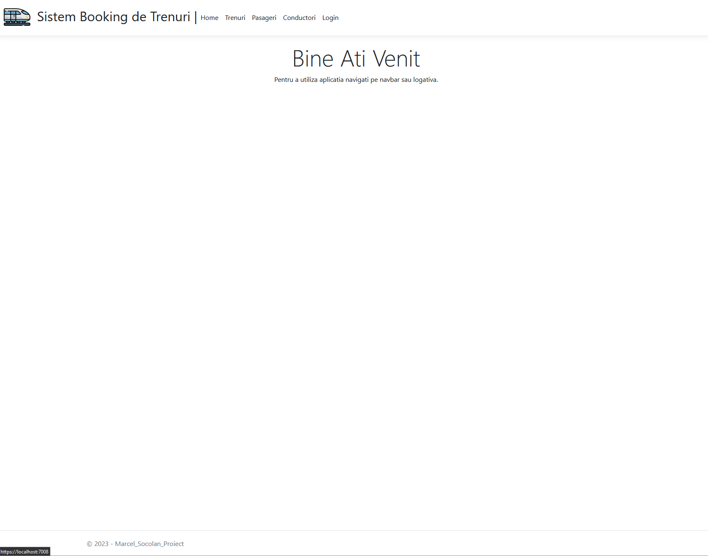
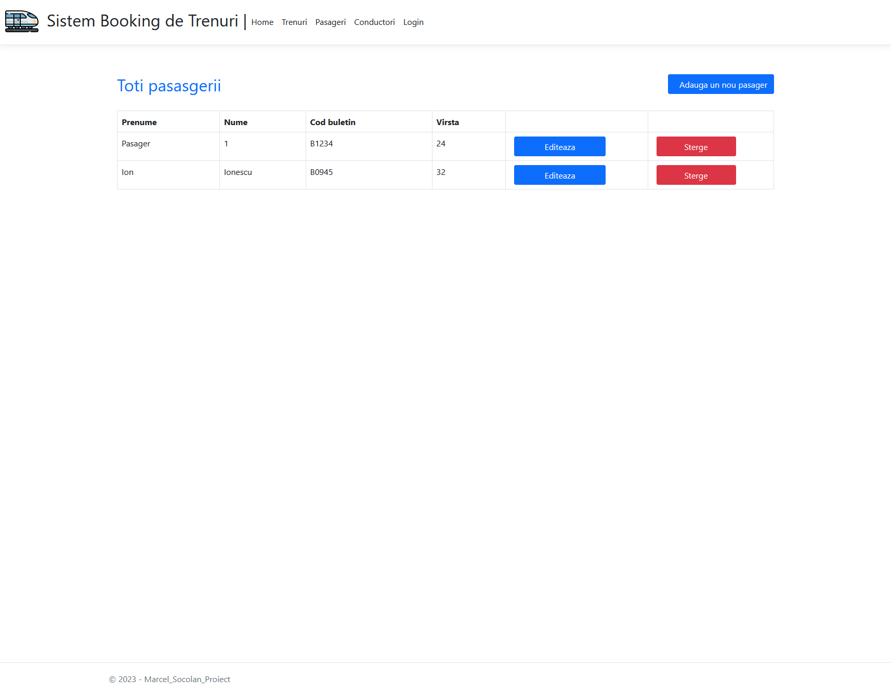

# Proiect pentru disciplina MPD, Marcel Socolan

# Tematica
Ideea principala este crearea unui booking sistem de trenuri

# Cerinte completate
* Sistemul este construit pe tehnologia ASP.NET Core MVC
* Implementeaza 5 tabele (Train, Route, Passenger, Conductor, User) de entitati si relatii intre ele.
* Contine pagini cu operatii CRUD pentru fiecare tip de entitate.
* Implementeaza un sistem simplu de autentificare/autorizare de tip cookies (pentru logare pot fi utilizate conturile username: admin1 , password: a1234 sau username: utilizator1 , password: u1234 , toate conturile pot fi gasite in fisierul UserConfiguration.cs)
* Are posibilitate de a popula tabelele cu test date, prin fisierele *Configurations.cs

# Imagini

    

    

